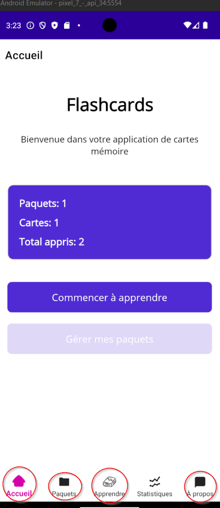

# Menu

Entraînement **bac à sable** : expérimenter le Shell (tabbar, flyout) sur un projet jetable avant de structurer votre fil rouge.

## Échauffement
Créer un projet MAUI (si pas déjà fait) et y ajouter une page — voir [Déclarer des routes Shell](../../supports/06-shell.md#declarer-des-routes).

## Tabbar
Implémenter un tabbar (shell) avec au minimum les entrées suivantes :

- Accueil
- Liste
- À propos

## Option
Activer le mode Flyout et Tabbar en même temps

Aide

> La structure Shell de *votre* application se réalise dans la **mission 02** de votre fil rouge.
