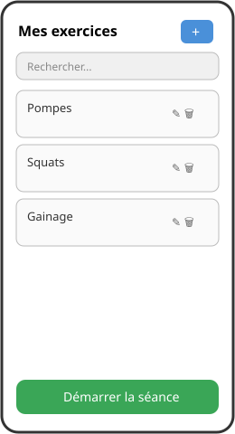
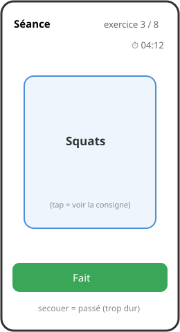
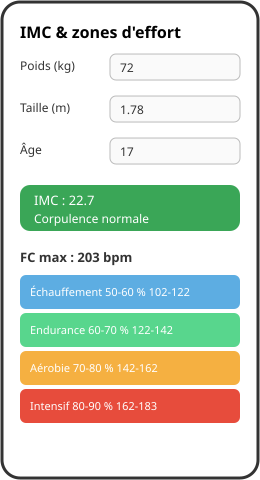

# Mission 01 — Storyboard

**À l'issue de cette mission, vous saurez :**
- traduire un cahier des charges en écrans concrets
- représenter la navigation et les actions d'une application mobile
- produire un livrable d'analyse de qualité professionnelle

## Spec

1. Lire attentivement le [CDC MyCoach](../cdc.md) — chaque exigence doit apparaître quelque part dans votre storyboard.
2. Maquetter **tous les écrans** de l'application : gestion des exercices (liste, ajout/édition), mode séance (nom, consigne), résumé de séance, écran IMC & zones.
3. Représenter la **navigation** : quelles actions mènent d'un écran à l'autre (flèches annotées).
4. Représenter les **actions** sur chaque écran : boutons, tap sur l'exercice, secousse du téléphone.
5. Annoter les contraintes du CDC directement sur les maquettes (ex : « max 255 caractères », « ordre aléatoire », « couleur par zone »).
6. Rédiger la demi-page **« économie des apps fitness »** exigée par le CDC (§4) dans vos notes personnelles.
7. Exporter le tout en **un PDF** nommé avec pertinence (ex : `luke-mycoach-storyboard-v1.pdf`).

## Maquette

Un storyboard, c'est un scénario dessiné — comme au cinéma :

Pour vous inspirer, les wireframes indicatifs de MyCoach (les vôtres peuvent différer si le CDC est respecté) :

| Liste | Séance | IMC |
| --- | --- | --- |
|  |  |  |

Papier + photo, Figma, PowerPoint... l'outil est libre : c'est le **contenu** qui compte.

## Théorie utile

- [Horizon mobile](../../../supports/01-horizon-mobile.md) — les conventions d'interface mobiles
- [Anatomie MAUI](../../../supports/02-anatomie-maui.md) — ce qu'une page peut contenir

## Indices

- Cette étape d'analyse est **primordiale** : chaque minute investie ici évite des heures de refactoring plus tard.
- Pensez aux cas « vides » : à quoi ressemble la liste sans aucun exercice ? L'écran IMC avant toute saisie ?
- Le mode séance a plusieurs états (nom affiché, consigne affichée, fin de séance) — un écran par état.
- Ne maquettez pas le podomètre ou les programmes (optionnels) avant d'avoir couvert tout l'obligatoire.

## Validation

- [ ] Chaque fonctionnalité obligatoire du CDC est visible sur au moins un écran
- [ ] La navigation entre tous les écrans est représentée et annotée
- [ ] Les actions utilisateur (tap, boutons, secousse) sont identifiées
- [ ] La demi-page « économie des apps fitness » est rédigée
- [ ] Le PDF est relu : orthographe, entêtes remplies, nom de fichier pertinent
- [ ] Vous pouvez « jouer » un scénario complet (créer un exercice → faire une séance → voir le résumé) en suivant votre storyboard du doigt
