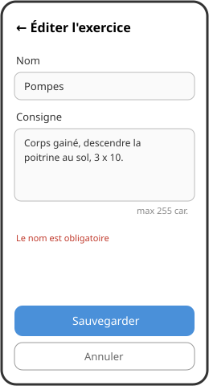

# Mission 03 — CRUD exercices

**À l'issue de cette mission, vous saurez :**
- modéliser une entité métier et son service de persistance
- implémenter un cycle complet Create / Read / Update / Delete
- afficher et filtrer une collection avec CollectionView et LINQ

## Spec

1. Modéliser la classe `Exercise` : identifiant, nom, consigne (+ ce que votre analyse juge utile : groupe musculaire, répétitions...).
2. **Create** : ajouter un exercice via un formulaire ; nom et consigne limités à **255 caractères** et non vides (validation avec message d'erreur).
3. **Read** : la liste des exercices s'affiche dans un `CollectionView` (nom visible au minimum) ; prévoir l'affichage « liste vide ».
4. **Update** : éditer un exercice existant en réutilisant la navigation avec paramètre de la mission 02.
5. **Delete** : supprimer un exercice **avec confirmation**.
6. **Persistance** : les exercices survivent au redémarrage complet de l'application (JSON dans `FileSystem.AppDataDirectory`).
7. **Filtre** : un champ de recherche réduit la liste aux exercices dont le nom ou la consigne contient le texte saisi (insensible à la casse).
8. *(Optionnel — CDC 3)* : plusieurs programmes, recherche multi-termes ET/OU, autocomplétion.

## Maquette

| Liste | Formulaire |
| --- | --- |
|  |  |

## Théorie utile

- [Structurer un projet : Models / Services / Pages](../../../supports/08a-crud.md#structurer-un-projet-models-services-pages)
- [Persister en JSON](../../../supports/08a-crud.md#persister-en-json)
- [Afficher une collection avec CollectionView](../../../supports/08a-crud.md#afficher-une-collection-avec-collectionview)
- [Formulaire et validation](../../../supports/08a-crud.md#formulaire-et-validation)
- [Filtrer avec LINQ](../../../supports/08a-crud.md#filtrer-avec-linq)

## Indices

- Une `List<T>` ne notifie pas la vue : après chaque modification, réassigner l'`ItemsSource` (ou utiliser `ObservableCollection`).
- `CommandParameter="{Binding .}"` passe l'exercice complet au gestionnaire du bouton ✏️/🗑️.
- Au retour de la page d'édition, rafraîchir la liste dans `OnAppearing`.
- `MaxLength="255"` sur l'`Entry` bloque la saisie côté UI — mais validez aussi côté code.
- Scroll du `CollectionView` capricieux ? Voir le [bug connu](../../../thematiques/03-CRUD.md#bug-du-scroll-dune-collectionview).

<details>
<summary>Coup de pouce — service de persistance</summary>

```csharp
public class ExerciseDataService
{
    private readonly string _filePath =
        Path.Combine(FileSystem.AppDataDirectory, "exercises.json");

    public async Task<List<Exercise>> LoadAsync()
    {
        if (!File.Exists(_filePath)) return new List<Exercise>();
        string json = await File.ReadAllTextAsync(_filePath);
        return ...;   // désérialiser (et gérer le cas null/erreur)
    }

    public async Task SaveAsync(List<Exercise> exercises)
    {
        string json = ...;   // sérialiser avec indentation
        await File.WriteAllTextAsync(_filePath, json);
    }
}
```

</details>

## Validation

- [ ] Ajout d'un exercice avec validation (vide et > 255 refusés avec message)
- [ ] Liste affichée, y compris l'état « aucun exercice »
- [ ] Édition d'un exercice existant fonctionnelle
- [ ] Suppression uniquement après confirmation
- [ ] Les exercices sont toujours là après avoir tué et relancé l'app
- [ ] Le filtre réduit la liste pendant la frappe et se réinitialise quand le champ est vidé
- [ ] Vous savez montrer le fichier JSON généré et expliquer son contenu
