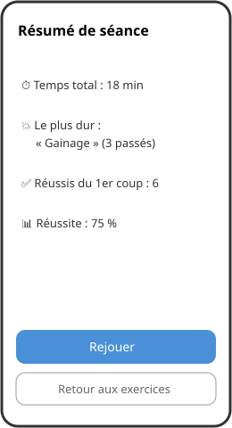

# Mission 04 — Mode séance

**À l'issue de cette mission, vous saurez :**
- orchestrer une logique de session (file d'exercices, états, statistiques)
- animer une transition visuelle significative (flip)
- exploiter l'accéléromètre en respectant son cycle de vie

## Spec

1. Depuis la liste, démarrer une **séance** avec les exercices en **ordre aléatoire**.
2. L'écran affiche le **nom** de l'exercice ; un tap sur la carte révèle la **consigne** avec une **animation de retournement** (flip).
3. Exercice accompli → bouton **« Fait »** : exercice suivant.
4. Exercice trop dur → **secouer le téléphone** (= « Passé ») : l'exercice est **remis dans la file** (mode loop) jusqu'à être accompli.
5. La séance se termine quand tous les exercices ont été « faits » au moins une fois ; afficher alors le **résumé** :
   1. temps total de la séance,
   2. exercice le plus difficile (le plus passé),
   3. nombre d'exercices réussis du premier coup,
   4. % de réussite (réussis du premier coup / total).
6. L'accéléromètre est **arrêté** dès qu'on quitte l'écran de séance.
7. **Écran IMC & zones (CDC 2.3)** : saisie poids/taille/âge validée, IMC + catégorie colorée, FC max et les 4 zones d'effort colorées.

## Maquette

Le flip attendu (même principe que la carte Flashquizz) :


| Séance | Résumé | IMC |
| --- | --- | --- |
|  |  |  |

## Théorie utile

- [Les 4 animations de base](../../../supports/10a-animation-cb.md#les-4-animations-de-base)
- [Enchaîner et combiner des animations](../../../supports/10a-animation-cb.md#enchainer-et-combiner-des-animations)
- [Détecter une secousse (shake)](../../../supports/11-accelero.md#detecter-une-secousse-shake)
- [Cycle de vie d'un capteur](../../../supports/11-accelero.md#cycle-de-vie-dun-capteur)

## Indices

- Mélanger une liste : `exercises.OrderBy(e => Random.Shared.Next()).ToList()` — ou un [Fisher-Yates](https://fr.wikipedia.org/wiki/M%C3%A9lange_de_Fisher-Yates) pour les puristes.
- Une `Queue<Exercise>` modélise naturellement la file : `Dequeue()` pour l'exercice courant, `Enqueue()` pour remettre un exercice passé en fin de file.
- Le flip se fait en **deux demi-rotations** sur l'axe Y — le contenu change au milieu, quand la carte est invisible.
- L'évènement `ShakeDetected` arrive sur un **thread secondaire** : `MainThread.BeginInvokeOnMainThread` obligatoire pour toucher l'UI.
- Comptez les « passés » **par exercice** (dictionnaire id → nombre) : le résumé en découle directement.
- IMC = poids / (taille × taille) ; FC max = 220 − âge ; chaque zone = un pourcentage de la FC max — de purs calculs, parfaits pour la mission 05.
- Secousse sur l'émulateur : `adb emu sensor set acceleration 100:100:100` (voir théorie).

<details>
<summary>Coup de pouce — squelette du flip</summary>

```csharp
private bool _showingConsigne = false;

private async void OnCardTapped(object sender, EventArgs e)
{
    if (_showingConsigne) return;   // déjà côté consigne

    await cardView.RotateYTo(90, 200);
    // ... changer le texte affiché (nom → consigne) ...
    cardView.RotationY = -90;
    await cardView.RotateYTo(..., ...);

    _showingConsigne = true;
}
```

</details>

## Validation

- [ ] L'ordre des exercices change d'une séance à l'autre
- [ ] Tap sur le nom → animation flip → consigne
- [ ] « Fait » passe à l'exercice suivant
- [ ] Secouer le téléphone remet l'exercice dans la file (démontrable sur émulateur via adb)
- [ ] Un exercice passé revient jusqu'à être fait ; la séance se termine bien
- [ ] Le résumé affiche les 4 statistiques exactes du CDC
- [ ] Quitter l'écran de séance arrête l'accéléromètre (démontrable dans le code)
- [ ] L'écran IMC calcule et colore correctement l'IMC et les 4 zones d'effort
